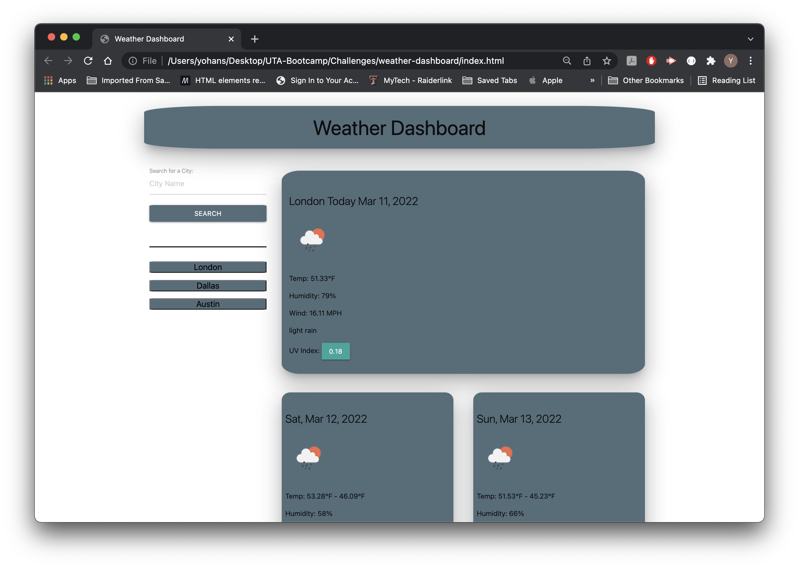

# Weather-Dashbord

## Description

This is a weather dashbord to see the weather outlook for multiple cities. Which presented the current and future conditions for that city and that city is added to the search history. 

## Table of Contents

- [Installation](#installation)
- [Usage](#usage)
- [Snapshot](#snapshot)
- [License](#license)
- [Tests](#tests)
- [License](#license)
- [Questions](#questions)

## Installation

follow the url

## Usage

search for any city 

[URL](https://yohans14.github.io/weather-dashboard/)

## Snapshot

## License

The project is licensed under MIT.

[More Info](https://choosealicense.com/licenses/)

## Contributing

If you like to contribut for this project please follow The Contributor Convenant guidelines.

## Tests

## Questions

If you have any questions.

Yohans Getaneh

GitHub: https://github.com/yohans14

Email: yohans14@yahoo.com
